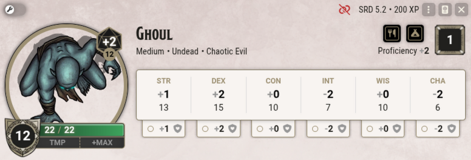
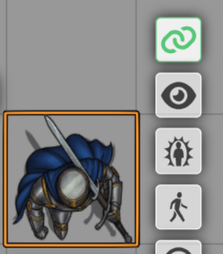
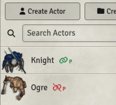
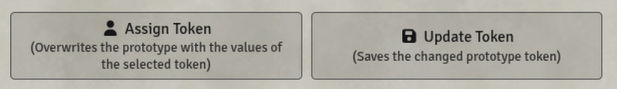
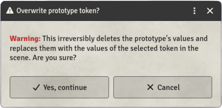

  
  

# Arga's Token Link Indicator

A small, system-agnostic module whose chain icon shows whether a token is linked to its Actor — and whether an open sheet belongs to a token in the scene or to the prototype token.

The chain icon sits in three places, each of them optional and switchable in the Game Settings:

- in the header of every **Actor sheet**,
- in the **Token HUD** whenever a token is selected (visible to Gamemasters only),
- next to every Actor name in the **Actors sidebar**.

<table align="center">
  <tr>
    <td align="center" colspan="2"></td>
  </tr>
  <tr>
    <td align="center" colspan="2"><em>Actor sheet header — this token is not linked</em></td>
  </tr>
  <tr>
    <td align="center"></td>
    <td align="center"></td>
  </tr>
  <tr>
    <td align="center"><em>Token HUD — linked (Gamemasters only)</em></td>
    <td align="center"><em>Actors sidebar — prototype tokens, linked and unlinked</em></td>
  </tr>
</table>

 

A **green chain icon** means that token and Actor are linked. Change the items or the values of one, and they change on the other as well. This is the usual setting for player characters.

A **red broken chain icon** means that token and Actor are not linked. The token can therefore carry values of its own. This is the usual setting for NPCs, and it allows all five orcs in a scene to have different amounts of health, for example.

If there is a small **P** next to the chain icon, the icon does not mean a token in the scene but the Actor's **prototype token** — the template new tokens are created from. Tokens dragged into a scene from a 'green' prototype token are linked to the Actor automatically; tokens from a 'red' one are not.

Every chain icon can be clicked in three ways:

- A ***left-click*** on a chain icon enables or disables the link. In the sidebar this affects the prototype token and therefore only tokens placed in the future.

- A ***right-click*** on a chain icon opens the configuration window of the token or of the prototype token. At the same time a coloured notification tells you whether you are editing the token in the scene or the prototype token. That window is where things like a token's vision range or the way its name is displayed are changed. Settings made there apply to the token in the scene only, never to the Actor in the sidebar, no matter whether they are linked or not.  
Changes to the prototype token likewise apply only to tokens you drag into a scene afterwards — tokens already placed stay untouched.

- A ***middle-click*** on the chain icon in a sheet or in the Token HUD reveals the Actor in the sidebar, where it flashes green a few times. For an unlinked token it reveals the base Actor the token was created from.

 

## Option: Clearer Button Labels

Foundry gives the save button of the **Token configuration** the very same label as the one of the **Prototype Token configuration** — which makes the two windows easy to confuse. And the *'Assign Token'* button replaces all values of the prototype with those of a selected token immediately, without asking. An optional setting adds short explanations to these buttons:

  

and asks before the prototype is overwritten:

  

 

## A Few Words on "Linking" — What Foundry Actually Does

The behaviour of linked and unlinked tokens described above is plain Foundry standard — ***Arga's Token Link Indicator*** merely makes the link visible.

Since linking can be confusing at times, here is a short summary:

A ***linked*** token has no values of its own: its sheet *is* the sheet of the base Actor, that is, of the entry in the sidebar. Every change to the Actor affects all of its linked tokens. The ***configuration settings*** however (vision range, for example) belong to each token alone.

An ***unlinked*** token stays connected to its base Actor as well! Change something on the Actor and you change the unlinked (!) token along with it. The only exception are values you have already changed on the token itself — those the token keeps.

***Example:*** Your prototype token "Orc" is unlinked. The orc carries a scimitar that deals a certain amount of damage. Now you drag three orcs into the scene. Since they are unlinked, you can change every one of them individually. On one of the orcs you set the damage of its scimitar *higher*. Only that one orc token then has the increased damage.  
On the Actor in the sidebar, however, you now *lower* the damage of the scimitar, and you add a shortbow to the inventory. Even though Actor and tokens are unlinked, as we said, all three orcs in the scene now carry a shortbow, and two of the three have a scimitar with *reduced* damage. Only the one orc whose damage you raised keeps its own *increased* value.

 

## Languages

The module is available in English and German.

 

## Manifest-URL
https://github.com/Arga-Mods/argas-token-link-indicator/releases/latest/download/module.json

## FoundryVTT.com
https://foundryvtt.com/packages/argas-token-link-indicator

 

---

## My Other Modules
If you like ***Arga's Token Link Indicator***, feel free to check out my other modules as well:

* **[Arga's Benny & Wound Panel (SWADE)](https://github.com/Arga-Mods/argas-benny-and-wound-panel-swade)** – A panel for quick adjustment of Bennies, Wounds, and Fatigue on selected tokens. Designed for Savage Worlds.
* **[Arga's Day-Night Slider](https://github.com/Arga-Mods/argas-day-night-slider)** – A slider for a smooth day/night transition in your scenes.
* **[Arga's Dice Roller](https://github.com/Arga-Mods/argas-dice-roller)** – A ***system-agnostic*** dice module with a Fate Roll function and additional features and dice mechanics for the **Savage Worlds Adventure Edition (SWADE)** game system, such as Critical Failures, Benny rerolls, Request Rolls, and Dramatic Tasks.
* **[Arga's SWADE SciFi Companion (German)](https://github.com/Arga-Mods/argas-swade-scifi-companion-german)** - A complete German translation of the English ***SWADE Science Fiction Companion*** premium module.
* **[Arga's SWADE Translation (German)](https://github.com/Arga-Mods/argas-swade-translation-german)** - A complete German translation of the English ***SWADE Core Rules*** premium module.
---

<em>Enjoy — Arga</em>

